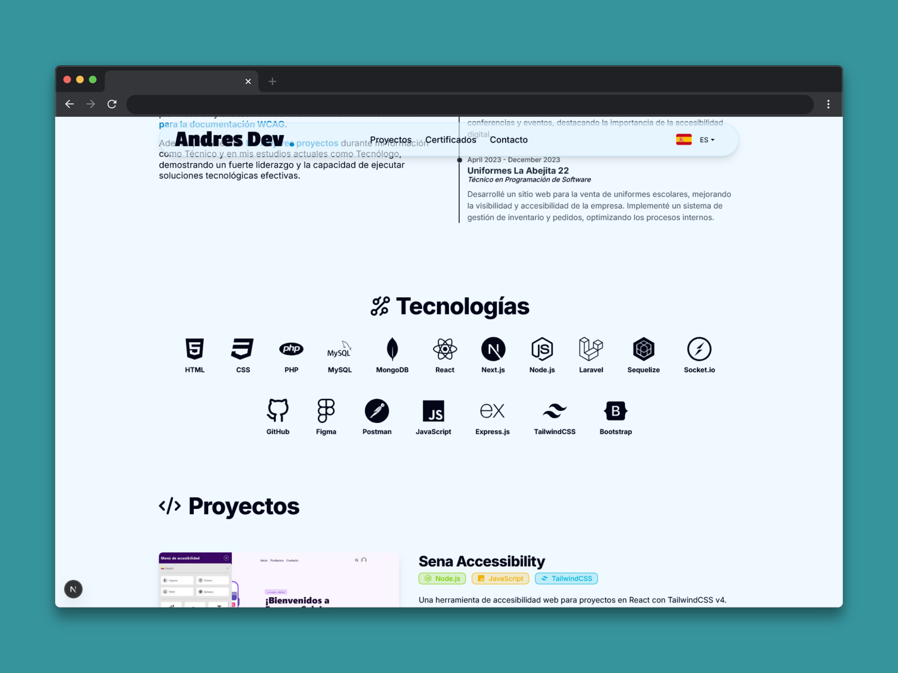
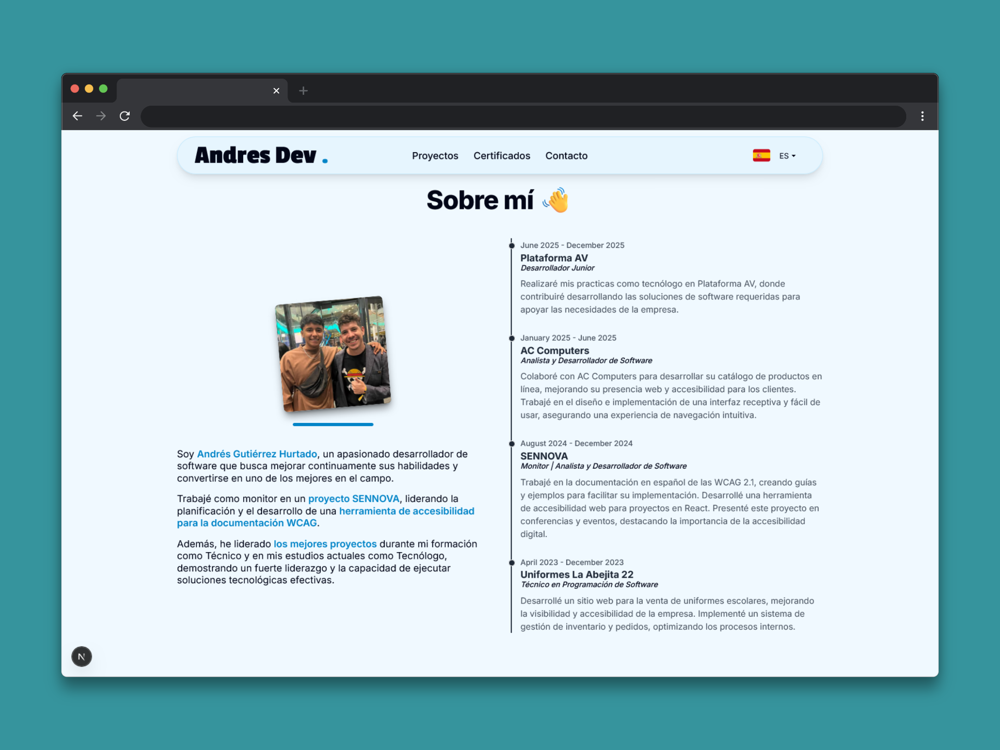
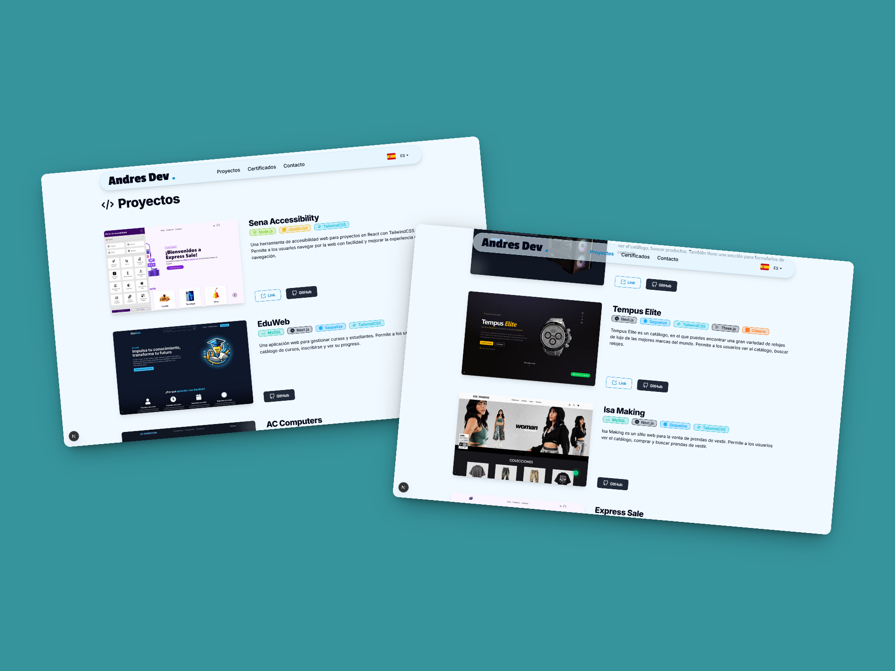
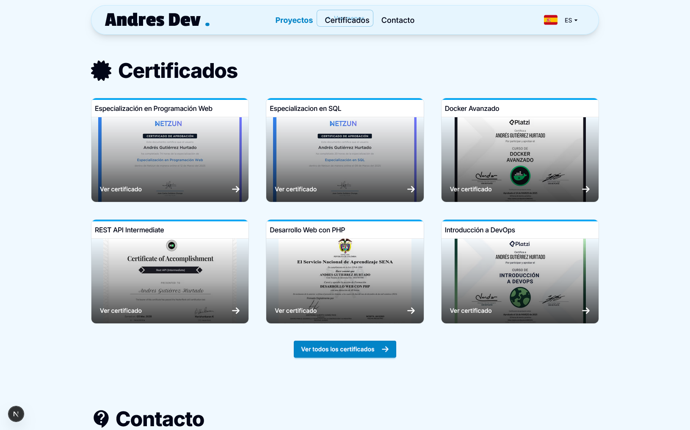
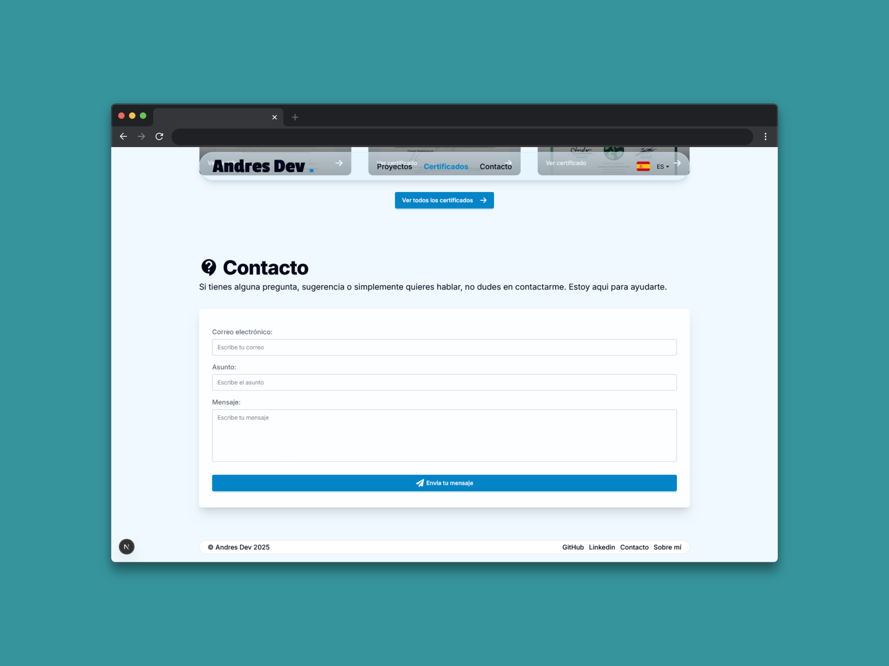

# 🤵 Portafolio Web - Andrés Gutiérrez Hurtado

[🌐 Sitio Web](https://andres-portfolio-b4dv.onrender.com)

[📑 English Version](./README.md)

Este es mi portafolio web personal donde muestro los proyectos que he desarrollado, mi experiencia profesional, proyectos y las habilidades técnicas que he adquirido a lo largo de mi trayectoria como desarrollador. He construido esta plataforma utilizando **Next.js 15** y **React 19** para crear una experiencia interactiva y moderna que refleje mi pasión por el desarrollo web. La aplicación incluye soporte completo para internacionalización (i18n) y una interfaz de usuario completamente responsiva, permitiéndome conectar con una audiencia global y demostrar mi capacidad para crear soluciones web profesionales y escalables.

---

## 📚 Tabla de Contenidos

- [🚀 Características Principales](#-características-principales)
- [🛠️ Tecnologías Utilizadas](#️-tecnologías-utilizadas)
- [📁 Estructura de Carpetas](#-estructura-de-carpetas)
- [💾 Instalación](#-instalación)
- [📬 Contacto](#-contacto)

---

## 🚀 Características Principales

### Tecnologías

Visualización interactiva de mi stack tecnológico y habilidades, con íconos y animaciones dinámicas.



### Sobre mí y experiencia

Descripción de mi perfil, formación y trayectoria profesional, acompañada de una línea de tiempo interactiva.



### Proyectos

Galería interactiva con capturas, descripciones, tecnologías utilizadas y enlaces a repositorios o demos. Incluye filtros por tecnología para facilitar la búsqueda.



### Certificados

Muestra visual de mis certificaciones profesionales y logros académicos.



### Contacto

Formulario con validación en tiempo real, envío de emails y notificaciones de estado.



### Otras características de diseño y funcionalidad

Incluye un diseño moderno y responsivo adaptado para desktop, tablet y móvil; navegación intuitiva con scroll suave y animaciones; optimización SEO; soporte multilenguaje (español e inglés) con cambio dinámico de idioma; y un sistema de notificaciones visuales para confirmaciones y errores.

---

## 🛠️ Tecnologías Utilizadas

### Frontend

- **Next.js 15** - Framework de React con App Router
- **React 19** - Biblioteca de interfaz de usuario
- **Tailwind CSS 4** - Framework de CSS utility-first
- **DaisyUI** - Componentes de UI para Tailwind CSS

### Internacionalización

- **next-intl** - Manejo completo de internacionalización
- **Middleware personalizado** - Configuración de rutas multiidioma

### Librerías Adicionales

- **React Icons** - Iconografía moderna
- **React Scroll** - Navegación suave entre secciones
- **React CountUp** - Animaciones de contadores
- **React Toastify** - Notificaciones elegantes
- **SweetAlert2** - Modales y alertas personalizadas
- **Valibot** - Validación de formularios
- **Resend** - Servicio de envío de emails

---

## 📁 Estructura de Carpetas

```
src/
├── app/                    # App Router de Next.js
│   ├── [locale]/           # Rutas dinámicas por idioma
│   │   ├── page.jsx        # Página principal
│   │   └── layout.jsx      # Layout específico por idioma
│   ├── api/                # Endpoints de API
│   │   └── contact/        # API para formulario de contacto
│   ├── globals.css         # Estilos globales
│   └── layout.jsx          # Layout principal
├── components/             # Componentes reutilizables
│   ├── contactForm.jsx     # Formulario de contacto
│   ├── dataCard.jsx        # Tarjetas de datos
│   ├── icons.jsx           # Componentes de iconos
│   └── projectsList.jsx    # Lista de proyectos
├── hooks/                  # Custom React hooks
│   └── useScroll.js        # Hook para scroll suave
├── i18n/                   # Configuración de internacionalización
│   ├── navigation.ts       # Configuración de navegación
│   ├── request.ts          # Configuración de requests
│   └── routing.ts          # Configuración de rutas
├── layout/                 # Componentes de layout
│   ├── Header.jsx          # Componente de navegación
│   └── Footer.jsx          # Componente de pie de página
├── lib/                    # Utilidades y configuraciones
│   ├── utils.js            # Funciones utilitarias
│   └── constants.js        # Constantes del proyecto
├── locale/                 # Archivos de traducción
│   ├── en.json             # Traducciones en inglés
│   └── es.json             # Traducciones en español
└── middleware.ts           # Middleware para i18n
```

---

## 💾 Instalación

### Prerrequisitos

- **Node.js** (versión 18 o superior)
- **npm** o **yarn**

### 1. Clonar el Repositorio

```bash
git clone https://github.com/AndresGutierrezHurtado/portfolio.git
cd portfolio
```

### 2. Instalar Dependencias

```bash
npm install
```

### 3. Configurar Variables de Entorno

Crea un archivo `.env.local` en la raíz del proyecto:

```env
# Configuración de Resend para el formulario de contacto
RESEND_API_KEY=tu_api_key_de_resend
```

### 4. Ejecutar en Desarrollo

```bash
npm run dev
```

La aplicación estará disponible en `http://localhost:3000`

### 5. Construir para Producción

```bash
npm run build
npm start
```

### Scripts Disponibles

- `npm run dev` - Inicia el servidor de desarrollo con Turbopack
- `npm run build` - Construye la aplicación para producción
- `npm run start` - Inicia el servidor de producción
- `npm run lint` - Ejecuta el linter para verificar el código

---

## 📬 Contacto

Para preguntas, soporte o colaboración, por favor contacta:

- **Andrés Gutiérrez Hurtado**
- **Correo Electrónico:** [andres52885241@gmail.com](mailto:andres52885241@gmail.com)
- **LinkedIn:** [Andrés Gutiérrez](https://www.linkedin.com/in/andr%C3%A9s-guti%C3%A9rrez-hurtado-25946728b/)
- **GitHub:** [@AndresGutierrezHurtado](https://github.com/AndresGutierrezHurtado)
- **Portafolio:** [Link portafolio](https://andres-portfolio-b4dv.onrender.com)
