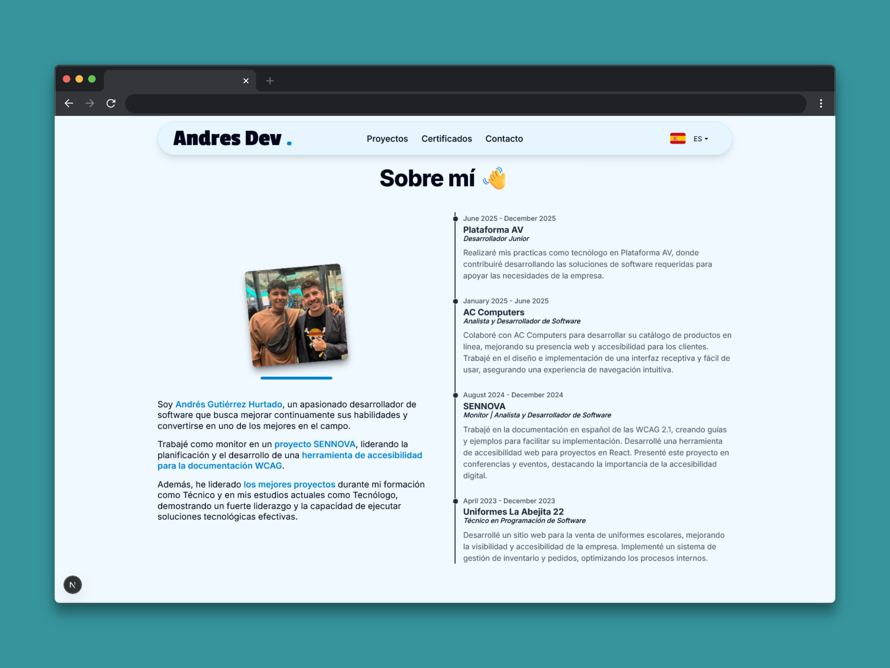
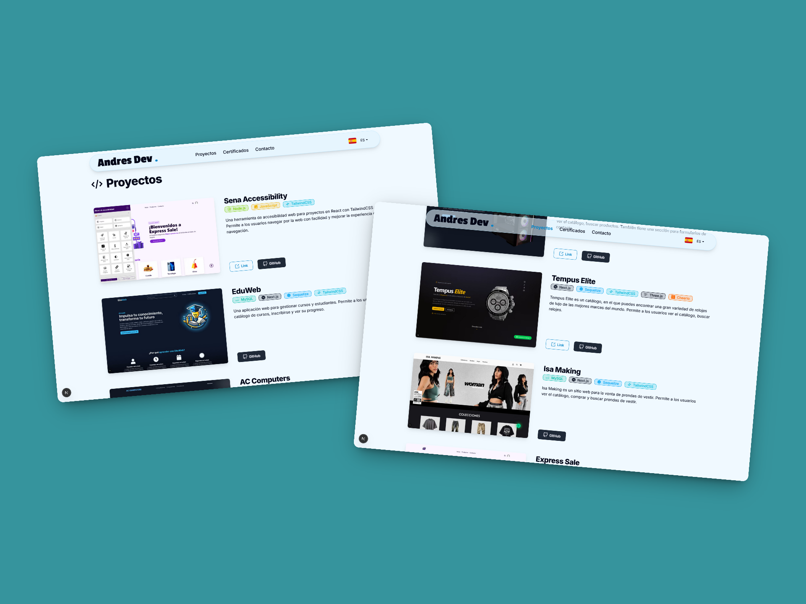

# 🤵 Portafolio Web - Andrés Gutiérrez Hurtado

[🌐 Website](https://andres-portfolio-b4dv.onrender.com)

[📑 Versión en Español](./README.es.md)

This is my personal web portfolio where I showcase the projects I have developed, my professional experience, and the technical skills I have acquired throughout my career as a developer. I built this platform using **Next.js 15** and **React 19** to create an interactive and modern experience that reflects my passion for web development. The application includes full support for internationalization (i18n) and a fully responsive user interface, allowing me to connect with a global audience and demonstrate my ability to create professional and scalable web solutions.

---

## 🚀 Main Features

### Technologies

Interactive visualization of my tech stack and skills, with icons and dynamic animations.

### About Me & Experience

Description of my profile, education, and professional background, accompanied by an interactive timeline.

### Projects

Interactive gallery with screenshots, descriptions, technologies used, and links to repositories or demos. Includes technology filters for easier searching.

### Certificates

Visual display of my professional certifications and academic achievements.

### Contact

Form with real-time validation, email sending, and status notifications.

### Other Design and Functionality Features

Includes a modern and responsive design adapted for desktop, tablet, and mobile; intuitive navigation with smooth scrolling and animations; SEO optimization; multilingual support (Spanish and English) with dynamic language switching; and a visual notification system for confirmations and errors.

