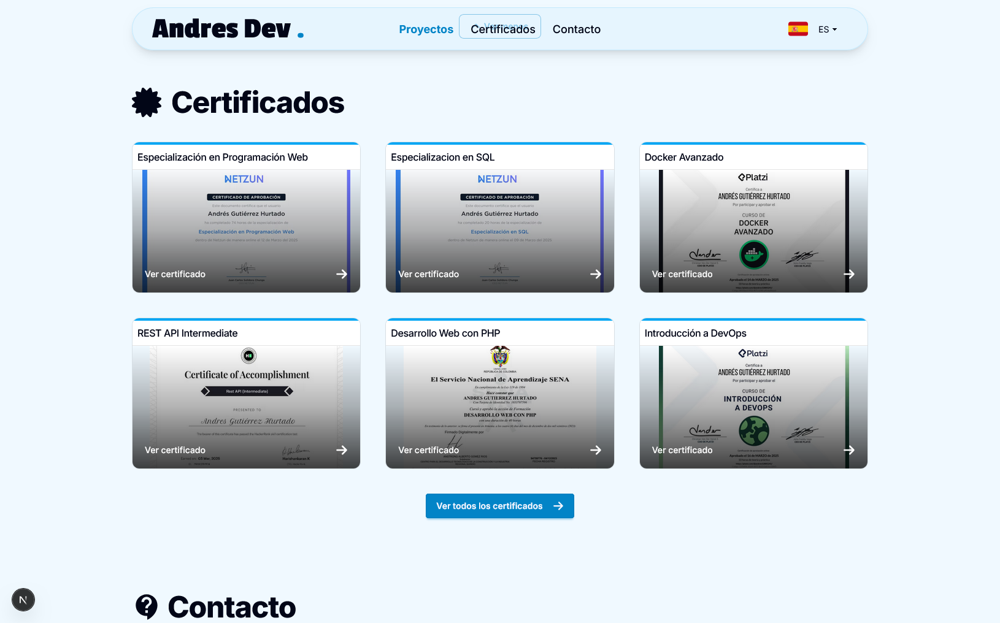
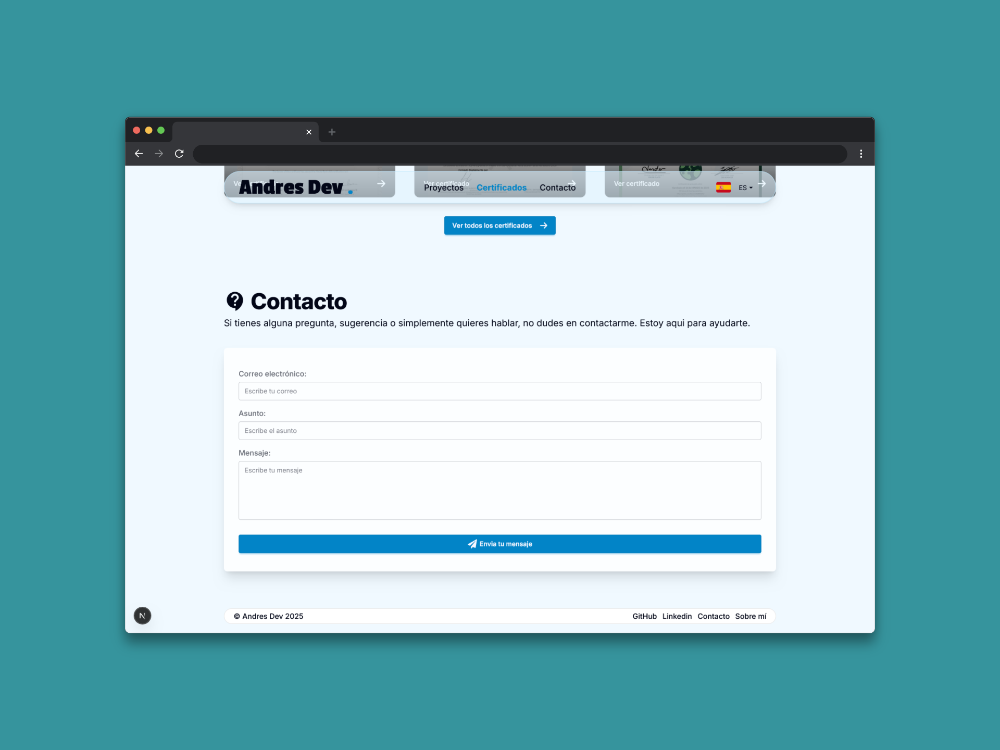

# 🤵 Portafolio Web - Andrés Gutiérrez Hurtado

[🌐 Website](https://andres-portfolio-b4dv.onrender.com)

[📑 Versión en Español](./README.es.md)

This is my personal web portfolio where I showcase the projects I have developed, my professional experience, and the technical skills I have acquired throughout my career as a developer. I built this platform using **Next.js 15** and **React 19** to create an interactive and modern experience that reflects my passion for web development. The application includes full support for internationalization (i18n) and a fully responsive user interface, allowing me to connect with a global audience and demonstrate my ability to create professional and scalable web solutions.

---

## 🚀 Main Features

### Technologies

Interactive visualization of my tech stack and skills, with icons and dynamic animations.


### About Me & Experience

Description of my profile, education, and professional background, accompanied by an interactive timeline.


### Projects

Interactive gallery with screenshots, descriptions, technologies used, and links to repositories or demos. Includes technology filters for easier searching.


### Certificates

Visual display of my professional certifications and academic achievements.



### Contact

Form with real-time validation, email sending, and status notifications.



### Other Design and Functionality Features

Includes a modern and responsive design adapted for desktop, tablet, and mobile; intuitive navigation with smooth scrolling and animations; SEO optimization; multilingual support (Spanish and English) with dynamic language switching; and a visual notification system for confirmations and errors.

---

## 🛠️ Technologies Used

### Frontend

-   **Next.js 15** - React framework with App Router
-   **React 19** - User interface library
-   **Tailwind CSS 4** - Utility-first CSS framework
-   **DaisyUI** - UI components for Tailwind CSS

### Internationalization

-   **next-intl** - Full-featured internationalization management
-   **Custom Middleware** - Multi-language route configuration

### Additional Libraries

-   **React Icons** - Modern iconography
-   **React Scroll** - Smooth navigation between sections
-   **React CountUp** - Counter animations
-   **React Toastify** - Elegant notifications
-   **SweetAlert2** - Custom modals and alerts
-   **Valibot** - Form validation
-   **Resend** - Email sending service

---

## 📁 Folder structure

```
src/
├── app/                    # Next.js App Router
│   ├── [locale]/           # Dynamic language routes
│   │   ├── page.jsx        # Main page
│   │   └── layout.jsx      # Language-specific layout
│   ├── api/                # API endpoints
│   │   └── contact/        # Contact form API
│   ├── globals.css         # Global styles
│   └── layout.jsx          # Main layout
├── components/             # Reusable components
│   ├── contactForm.jsx     # Contact form
│   ├── dataCard.jsx        # Data cards
│   ├── icons.jsx           # Icon components
│   └── projectsList.jsx    # Projects list
├── hooks/                  # Custom React hooks
│   └── useScroll.js        # Smooth scroll hook
├── i18n/                   # Internationalization configuration
│   ├── navigation.ts       # Navigation configuration
│   ├── request.ts          # Request configuration
│   └── routing.ts          # Route configuration
├── layout/                 # Layout components
│   ├── Header.jsx          # Navigation component
│   └── Footer.jsx          # Footer component
├── lib/                    # Utilities and configurations
│   ├── utils.js            # Utility functions
│   └── constants.js        # Project constants
├── locale/                 # Translation files
│   ├── en.json             # English translations
│   └── es.json             # Spanish translations
└── middleware.ts           # i18n middleware
```

